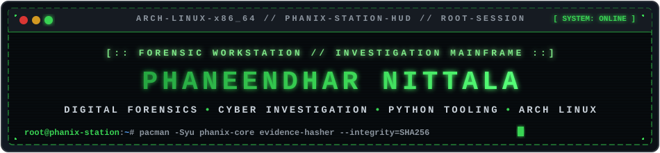
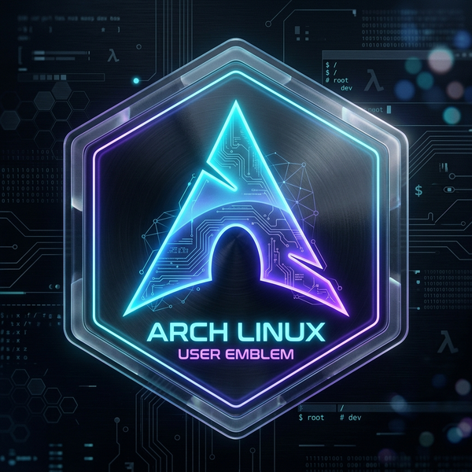
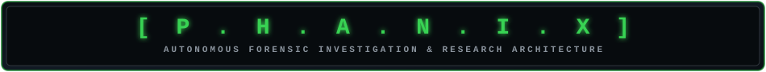
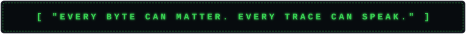
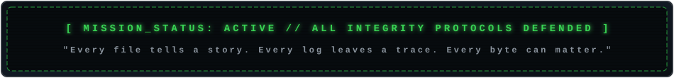

<div align="center">

<!-- RETRO MAINFRAME CASSETTE HEADER -->
<a href="https://github.com/NPhaneendhar">
  
</a>

<br><br>

<!-- PHANIX OFFICIAL BRAND ICON -->
<a href="https://github.com/NPhaneendhar">
  
</a>

<br><br>

<!-- RETRO CRT MONOSPACE TYPEWRITER -->


<br><br>

<!-- RETRO TERMINAL CONTROL PANELS / BADGES -->
<p>
  <a href="https://nphaneendhar.github.io/phaneendhar-nittala-portfolio/"></a>
  <a href="https://nphaneendhar.github.io/P.H.A.N.I.X-FORENSIC-QR-ARCHITECT"></a>
  <a href="https://p-h-a-n-i-x-investigation-e-xpert.vercel.app"></a>
</p>
<p>
  <a href="https://p-h-a-n-i-x-python-learn.vercel.app"></a>
  <a href="https://nittala-forensic-suite.vercel.app"></a>
  <a href="https://www.linkedin.com/in/phaneendhar-nittala-a2a3443a1/"></a>
  <a href="mailto:nittalaphaneendhar@gmail.com"></a>
</p>

<!-- RETRO TELEMETRY METERS -->
<p>
  
  &nbsp;
  
  &nbsp;
  
  &nbsp;
  
</p>

</div>

```text
========================================================================================================
[SYS_REPORT] RETRO CONSOLE READY // TIME_SYNC: UTC // USER: PHANEENDHAR // MODE: FORENSIC INVESTIGATION
========================================================================================================
```

<div align="center">

## 💾 `SYSTEM HOST: ARCH LINUX`

### *"Windows asked me to restart. Arch asked me to understand."*

<a href="https://archlinux.org/">
  
</a>

<br><br>

<p>
  
  
  
</p>

```bash
[root@phanix-station ~]# pacman -Syu --noconfirm forensic-tools sha256-engine python3
[root@phanix-station ~]# echo "STATUS: ACTIVE // INTEGRITY: DEFENDED"
```

</div>

<br>

<div align="center">

## 📊 `INVESTIGATOR CONTRIBUTION AUDIT`


</div>

```text
+------------------------------------------------------------------------------------------------------+
| 01 // OPERATOR DOSSIER & PROFILE RECORD                                                              |
+------------------------------------------------------------------------------------------------------+
```

<table width="100%">
<tr>
<td width="36%" align="center" valign="middle">


<br><br>

<b><font size="4" color="#39D353">PHANEENDHAR NITTALA</font></b>
<br>
<sub>Digital Forensics • Cyber Investigation • Tooling Architect</sub>

<br><br>

<a href="https://nphaneendhar.github.io/phaneendhar-nittala-portfolio/">
  
</a>

</td>
<td width="64%" valign="top">

### 📋 `TERMINAL IDENTITY SPECS`

```text
+-----------------------------------------------------------------------+
| OPERATOR     : PHANEENDHAR NITTALA                                    |
| DOMAIN       : DIGITAL FORENSICS & CYBER INVESTIGATION                |
| WORKSTATION  : ARCH LINUX (x86_64) // ROLLING KERNEL                  |
| INITIATIVE   : PHANIX ARCHITECTURE SYSTEM                             |
| CODE BASES   : PYTHON • BASH • C • JAVASCRIPT / REACT                 |
| SPECIALTY    : EVIDENCE INTEGRITY • SHA-256 HASHING • CHAIN OF CUSTODY|
| OBJECTIVE    : ENGINEERING MISSION-CRITICAL INVESTIGATION TOOLS       |
| CLEARANCE    : ROOT // LEVEL-05 AUDIT VERIFIED                        |
+-----------------------------------------------------------------------+
```

### ⚡ `CORE CAPABILITIES & FIELDS`

- 🔬 **Digital Forensics**: Filesystem forensics, bit-stream imaging & artifact extraction
- 🛡️ **Cyber Defense & Recon**: OSINT frameworks, network mapping (`nmap`) & threat mitigation
- 🤖 **Forensic AI**: Local LLM intelligence (Ollama) & retrieval-augmented generation (RAG)
- 🐧 **Linux Automation**: Kernel custom builds, Bash pipeline tooling & system inspection
- 🔐 **Cryptographic Verification**: Defensible SHA-256 evidence integrity & QR-based validation

</td>
</tr>
</table>

```text
+------------------------------------------------------------------------------------------------------+
| 02 // THE PHANIX ECOSYSTEM                                                                           |
+------------------------------------------------------------------------------------------------------+
```

<div align="center">



### **Phaneendhar's Investigation eXpert**

`FORENSICS` &nbsp;✦&nbsp; `CYBER AUDIT` &nbsp;✦&nbsp; `AI` &nbsp;✦&nbsp; `INTELLIGENCE` &nbsp;✦&nbsp; `AUTOMATION`

*PHANIX is a comprehensive investigation architecture merging digital forensics, cybersecurity, and intelligent software.*

<br><br>

```text
                       +---------------------------------------+
                       |           PHANIX ECOSYSTEM            |
                       +-------------------+-------------------+
                                           |
           +-------------------------------+-------------------------------+
           |                               |                               |
           v                               v                               v
     [ FORENSICS ]                 [ CYBER DEFENSE ]                 [ AI ENGINES ]
           |                               |                               |
     +-----+-----+                   +-----+-----+                   +-----+-----+
     |     |     |                   |     |     |                   |     |     |
     v     v     v                   v     v     v                   v     v     v
   HASH  META EVIDENCE             OSINT  NMAP THREAT              RAG  LOCAL-LLM AUDIT
     |     |     |                   |     |     |                   |     |     |
     +-----+-----+-------------------+-----+-----+-------------------+-----+-----+
                                           |
                                           v
                       [ UNIFIED FORENSIC INVESTIGATION LAB ]
```

</div>

```text
+------------------------------------------------------------------------------------------------------+
| 03 // FLAGSHIP PLATFORM: FORENSIC QR ARCHITECT                                                       |
+------------------------------------------------------------------------------------------------------+
```

<div align="center">

## `PHANIX — FORENSIC QR ARCHITECT`
### **Defensible Evidence Identity • Tamper-Proof Integrity • Instant Optical Verification**

<p>
  
  
  
  
</p>

</div>

<table width="100%">
<tr>
<td width="52%" valign="top">

### 🔬 `Mission Profile & System Specs`

Built for digital forensics field units and courtroom defensibility:

- 🔐 **Instant SHA-256 Checksum**: Immediate cryptographic calculation of file hashes
- 🧬 **UUID Custody Tracking**: Unique, immutable serial identification per artifact
- 📱 **Optical QR Terminal**: Rapid field verification via optical scanners or webcams
- 👤 **Operator Access Log**: Operator ID, credentials, and verification auditing
- 🕒 **Tamper-Evident Timestamps**: UTC temporal watermarks embedded in QR packages
- 🔎 **Risk Analysis Engine**: Heuristic detection of anomalous file alterations
- 📋 **Chain of Custody Logs**: Exportable evidentiary reports ready for trial

<br>

<a href="https://nphaneendhar.github.io/P.H.A.N.I.X-FORENSIC-QR-ARCHITECT">
  
</a>

</td>
<td width="48%" align="center" valign="middle">

<a href="https://nphaneendhar.github.io/P.H.A.N.I.X-FORENSIC-QR-ARCHITECT">
  
</a>

<br>
<sub><b>TERMINAL HUD</b> — Optical Verification & Cryptographic Checksum Engine</sub>

</td>
</tr>
</table>

```text
+------------------------------------------------------------------------------------------------------+
| 04 // PRODUCTION PLATFORMS & LAB APPLICATIONS                                                        |
+------------------------------------------------------------------------------------------------------+
```

<table width="100%">
<tr>
<td width="50%" valign="top">

### 🔐 [PHANIX Forensic QR Architect](https://nphaneendhar.github.io/P.H.A.N.I.X-FORENSIC-QR-ARCHITECT)
**Evidence Identity, Integrity & Verification System**  
`React` • `SHA-256` • `ZXing Engine` • `Chain-of-Custody`  
<br>
<a href="https://nphaneendhar.github.io/P.H.A.N.I.X-FORENSIC-QR-ARCHITECT">
  
</a>

</td>
<td width="50%" valign="top">

### 🕵️ [PHANIX Investigation Expert](https://p-h-a-n-i-x-investigation-e-xpert.vercel.app)
**Digital Investigation & Forensic Analytics Suite**  
`Full-Stack` • `Forensics` • `OSINT` • `Investigation UX`  
<br>
<a href="https://p-h-a-n-i-x-investigation-e-xpert.vercel.app">
  
</a>

</td>
</tr>
<tr>
<td width="50%" valign="top">

### 🐍 [PHANIX Python Learn](https://p-h-a-n-i-x-python-learn.vercel.app)
**Interactive Python Learning & Forensic Scripting Hub**  
`Python 3` • `Interactive Labs` • `Data Analysis` • `Tooling`  
<br>
<a href="https://p-h-a-n-i-x-python-learn.vercel.app">
  
</a>

</td>
<td width="50%" valign="top">

### 🔬 [Nittala Forensic Suite](https://nittala-forensic-suite.vercel.app)
**Digital Evidence Analysis & Forensic Verification Toolkit**  
`Hashing` • `Metadata Extraction` • `File Inspection` • `Audit`  
<br>
<a href="https://nittala-forensic-suite.vercel.app">
  
</a>

</td>
</tr>
</table>

```text
+------------------------------------------------------------------------------------------------------+
| 05 // SYSTEM METRICS & PERFORMANCE TELEMETRY                                                         |
+------------------------------------------------------------------------------------------------------+
```

<div align="center">

<table width="100%">
<tr>
<td width="50%" align="center">
  
</td>
<td width="50%" align="center">
  
</td>
</tr>
<tr>
<td colspan="2" align="center">
  
</td>
</tr>
</table>

</div>

```text
+------------------------------------------------------------------------------------------------------+
| 06 // TECHNICAL ARSENAL & SKILL MATRIX                                                               |
+------------------------------------------------------------------------------------------------------+
```

<div align="center">

### 💻 `PROGRAMMING & SYSTEM SCRIPTING`
<p>
  
</p>

### 🛠️ `FRAMEWORKS, TOOLING & DEV ENVIRONMENT`
<p>
  
</p>

### 🐧 `INVESTIGATION OPERATING SYSTEMS`
<p>
  
</p>

</div>

<br>

<table width="100%">
<tr>
<td width="33%" align="center">

### 🔬 `DIGITAL FORENSICS`
Evidence Recovery • SHA-256 Hashes • Metadata Analysis • Chain of Custody

</td>
<td width="33%" align="center">

### 🛡️ `CYBER INTELLIGENCE`
OSINT Investigations • Nmap Network Auditing • Wireshark Packet Parsing • Threat Analysis

</td>
<td width="33%" align="center">

### 🤖 `FORENSIC AI`
Local LLMs (Ollama) • RAG Implementations • Evidence Doc Summarization • Telemetry

</td>
</tr>
<tr>
<td align="center">

### 🐍 `PYTHON ENGINE`
Automation Scripts • Crypto Checksum Tools • Binary File Parsing • Pandas

</td>
<td align="center">

### 🐧 `ARCH LINUX & POSIX`
Hardened System Kernel • Bash Pipeline Automation • Kernel Auditing • Low-level Debugging

</td>
<td align="center">

### 🌐 `DEFENSIVE UI / UX`
Retro Terminal Consoles • Real-time Webcam Scanners • Defensible Court Reporting

</td>
</tr>
</table>

```text
+------------------------------------------------------------------------------------------------------+
| 07 // INTERACTIVE INVESTIGATOR WORKSTATION (CLICK TO EXPAND CONSOLES)                                 |
+------------------------------------------------------------------------------------------------------+
```

<div align="center">

### 🕹️ *Select an interactive module below to reveal live console data*

</div>

<details>
<summary><b>▶ [CONSOLE 01] FORENSIC CHAIN-OF-CUSTODY AUDIT PROTOCOL</b></summary>
<br>

```text
+=============================================================================+
| STAGE 1 : IDENTIFY   | Pinpoint target disk / physical / virtual media       |
| STAGE 2 : ISOLATE    | Hardware write-blocker + Faraday RF isolation         |
| STAGE 3 : ACQUIRE    | Bit-stream forensic clone (.dd / .raw / .E01)         |
| STAGE 4 : HASH       | Cryptographic SHA-256 fingerprint generated           |
| STAGE 5 : VERIFY     | Bit-for-bit duplicate verification with source        |
| STAGE 6 : ANALYZE    | Read-only timeline, metadata, and artifact extraction  |
| STAGE 7 : REPORT     | Defensible courtroom-grade evidentiary export         |
+=============================================================================+
```

</details>

<details>
<summary><b>▶ [CONSOLE 02] ARCH LINUX INVESTIGATOR TERMINAL COMMANDS</b></summary>
<br>

```bash
# Calculate SHA-256 forensic checksum:
$ sha256sum evidence_drive.raw > checksum.sha256

# Verify integrity against stored hash:
$ sha256sum -c checksum.sha256

# Extract printable strings from suspicious binaries:
$ strings -a -n 8 suspicious.bin | grep -iE 'http|pass|token|admin|ssh'

# Forensic file inspection and metadata dump:
$ stat evidence_file.bin && file -k evidence_file.bin
```

</details>

<details>
<summary><b>▶ [CONSOLE 03] ACTIVE RESEARCH & MISSION ROADMAP</b></summary>
<br>

- 🧠 **RAG-Powered Forensic Analysis**: Natural language interrogation of 1000+ page police case files with local LLMs
- 🔬 **Cryptographic Evidence QR**: Embedding signed ECDSA verification tags into physical forensic seals
- 🛰️ **Cross-Platform Volatile Memory Dumper**: Memory capture utility written in C & Python
- ⚡ **Automated OSINT Aggregator**: Correlating threat actor aliases across intelligence feeds

</details>

```text
+------------------------------------------------------------------------------------------------------+
| 08 // INVESTIGATION METHODOLOGY                                                                      |
+------------------------------------------------------------------------------------------------------+
```

<div align="center">

```text
[ QUESTION ] ===> [ COLLECT ] ===> [ PRESERVE ] ===> [ VERIFY ] ===> [ ANALYZE ] ===> [ REPORT ]
```

### **"Question everything. Preserve everything. Verify everything."**

</div>

```text
+------------------------------------------------------------------------------------------------------+
| 09 // PHILOSOPHY & PRINCIPLES                                                                        |
+------------------------------------------------------------------------------------------------------+
```

<div align="center">

> **Forensic science taught me to look at evidence.**  
> **Programming taught me to build the tools.**  
> **Cybersecurity taught me to anticipate the attack.**  
> **AI showed me new ways to connect the pieces.**  
> **PHANIX is where they converge.**

<br>



### **Every file tells a story. Every log leaves a trace. Every byte can matter.**

`INVESTIGATE` &nbsp;•&nbsp; `VERIFY` &nbsp;•&nbsp; `BUILD`

</div>

<br>

<div align="center">



<br><br>

<!-- FOOTER LOGO -->
<a href="https://github.com/NPhaneendhar">
  
</a>

# `PHANIX`

### **Built with curiosity. Driven by evidence. Engineered with purpose.**

<p>
  <a href="https://github.com/NPhaneendhar"></a>
  <a href="https://nphaneendhar.github.io/phaneendhar-nittala-portfolio/"></a>
  <a href="https://www.linkedin.com/in/phaneendhar-nittala-a2a3443a1/"></a>
  <a href="mailto:nittalaphaneendhar@gmail.com"></a>
</p>


<br><br>

`[ SYS_HALT ] © PHANEENDHAR NITTALA // ARCH LINUX // PHANIX FORENSIC LABS`

</div>
