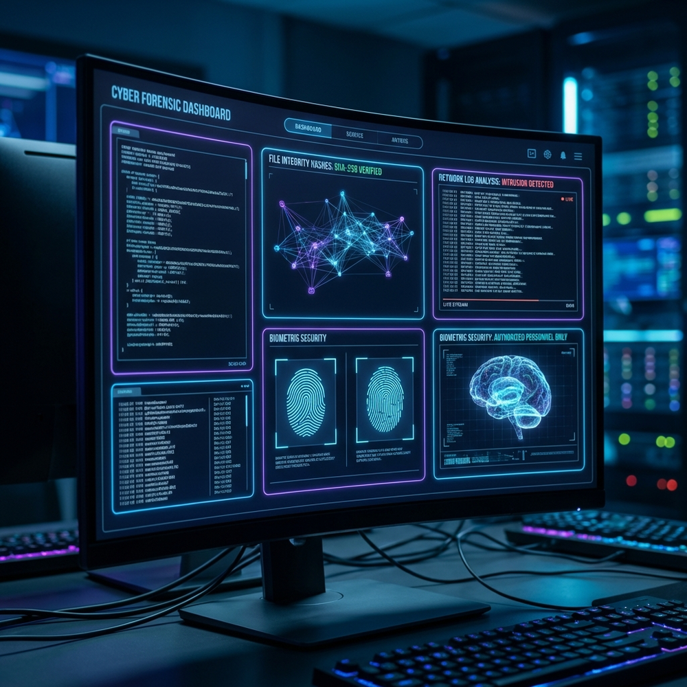

<div align="center">

<!-- HERO BANNER -->


<br>

<!-- PHANIX OFFICIAL BRAND ICON WITH GLOW -->
<a href="https://github.com/NPhaneendhar">
  
</a>

<br><br>

<!-- DYNAMIC TYPING TERMINAL -->


<br><br>

<!-- LIVE INTERACTIVE / QUICK NAVIGATION HUBS -->
<p>
  <a href="https://nphaneendhar.github.io/phaneendhar-nittala-portfolio/"></a>
  <a href="https://nphaneendhar.github.io/P.H.A.N.I.X-FORENSIC-QR-ARCHITECT"></a>
  <a href="https://p-h-a-n-i-x-investigation-e-xpert.vercel.app"></a>
</p>
<p>
  <a href="https://p-h-a-n-i-x-python-learn.vercel.app"></a>
  <a href="https://nittala-forensic-suite.vercel.app"></a>
  <a href="https://www.linkedin.com/in/phaneendhar-nittala-a2a3443a1/"></a>
  <a href="mailto:nittalaphaneendhar@gmail.com"></a>
</p>

<!-- REAL-TIME TELEMETRY / COUNTERS -->
<p>
  
  &nbsp;
  
  &nbsp;
  
</p>

</div>

<br>

<br>

<div align="center">

## 🐧 `OPERATING SYSTEM ENVIRONMENT`

### *"Windows asked me to restart. Arch asked me to understand."*

<a href="https://archlinux.org/">
  
</a>

<br><br>

<p>
  
  
  
</p>

```bash
$ sudo pacman -Syu && investigate --target "evidence" --verify sha256 --status ACTIVE
```

</div>

<br>

<div align="center">

## 📈 `ACTIVITY & CONTRIBUTION TRAIL`


</div>

<br>

<br>

# 🧬 `01` — OPERATOR DOSSIER & PROFILE

<table width="100%">
<tr>
<td width="36%" align="center" valign="middle">


<br><br>

<b><font size="4" color="#00E5FF">PHANEENDHAR NITTALA</font></b>
<br>
<sub>Digital Forensics • Cyber Investigation • Tool Architect</sub>

<br><br>

<a href="https://nphaneendhar.github.io/phaneendhar-nittala-portfolio/">
  
</a>

</td>
<td width="64%" valign="top">

### 🔎 `SECURE SYSTEM DOSSIER`

```text
╭──────────────────────────────────────────────────────────────────────────╮
│  OPERATOR    ::  PHANEENDHAR NITTALA                                     │
│  DOMAIN      ::  DIGITAL FORENSICS • CYBER INVESTIGATION                 │
│  CORE SYSTEM ::  ARCH LINUX (x86_64) // HARDENED KERNEL                  │
│  FRAMEWORK   ::  PHANIX INITIATIVE (INVESTIGATION ARCHITECTURE)          │
│  LANGUAGES   ::  PYTHON • BASH • C • JAVASCRIPT                          │
│  SPECIALTY   ::  CRYPTOGRAPHIC HASHING • CHAIN OF CUSTODY • METADATA    │
│  MISSION     ::  ENGINEERING MODERN EVIDENCE & INVESTIGATION TOOLING     │
│  CLEARANCE   ::  LEVEL 04 // OPERATIONAL                                 │
╰──────────────────────────────────────────────────────────────────────────╯
```

### ⚡ `SPECIALIZED DOMAIN FOCUS`

- 🔬 **Digital Evidence Extraction**: Filesystem analysis, forensic artifact recovery & tamper detection
- 🛡️ **Cyber Defense & OSINT**: Reconnaissance, network packet auditing (Nmap/Wireshark) & threat correlation
- 🤖 **Forensic Intelligence AI**: Local LLM telemetry (Ollama) & Retrieval-Augmented Generation (RAG)
- 🐧 **Linux Kernel & Tooling**: Native Arch Linux scripts, automation, and POSIX shell engineering
- 🔐 **Cryptographic Verification**: Defensible SHA-256 evidence integrity & QR-based optical tracking

</td>
</tr>
</table>

<br>

<br>

# 🌌 `02` — THE PHANIX ECOSYSTEM

<div align="center">


### **Phaneendhar's Investigation eXpert**

`FORENSICS` &nbsp;✦&nbsp; `CYBER INTELLIGENCE` &nbsp;✦&nbsp; `AI` &nbsp;✦&nbsp; `AUTOMATION` &nbsp;✦&nbsp; `INTEGRITY`

*PHANIX is an advanced unified ecosystem combining digital forensics, cybersecurity tooling, and AI into mission-critical investigation workflows.*

<br>



<br>
<sub><b>PHANIX INTELLIGENCE STATION</b> — Real-time telemetry, cryptographic verification, biometric security & neural analysis</sub>

<br><br>

```text
                               ┌───────────────────────────┐
                               │     PHANIX ECOSYSTEM      │
                               └─────────────┬─────────────┘
                                             │
             ┌───────────────────────────────┼───────────────────────────────┐
             │                               │                               │
             ▼                               ▼                               ▼
       🔬 FORENSICS                    🛡️ CYBER AUDIT                      🤖 AI ENGINE
             │                               │                               │
      ┌──────┼──────┐                 ┌──────┼──────┐                 ┌──────┼──────┐
      ▼      ▼      ▼                 ▼      ▼      ▼                 ▼      ▼      ▼
    HASH   META  EVIDENCE           OSINT  NMAP  THREAT             RAG  LOCAL-LLM TELEMETRY
      │      │      │                 │      │      │                 │      │      │
      └──────┴──────┴─────────────────┼──────┴──────┴─────────────────┴──────┴──────┘
                                      ▼
                        DEFENSIBLE FORENSIC TOOLING
```

</div>

<br>

<br>

# 🔐 `03` — FLAGSHIP PLATFORM

<div align="center">

## `PHANIX — FORENSIC QR ARCHITECT`
### **Defensible Evidence Identity • Tamper-Proof Integrity • Instant Optical Verification**

<p>
  
  
  
  
</p>

</div>

<br>

<table width="100%">
<tr>
<td width="52%" valign="top">

### 🔬 `Mission & Key Capabilities`

Engineered for field forensic investigators and cyber response units requiring instant evidence identity:

- 🔐 **Instant SHA-256 Hashing**: Cryptographic verification preventing evidence tampering
- 🧬 **UUID Immutable Records**: Traceable custody IDs generated at seizure
- 📱 **Optical QR Terminal**: Immediate field scans with hardware or web cameras
- 👤 **Audited Operator Verification**: Role credentials & badge validation logging
- 🕒 **Tamper-Evident Registration**: Precise UTC temporal watermarking
- 🔎 **Dynamic Heuristic Risk Scoring**: Automated artifact anomaly alerts
- 📋 **Court-Defensible Audit Trail**: Standardized chain-of-custody export

<br>

<a href="https://nphaneendhar.github.io/P.H.A.N.I.X-FORENSIC-QR-ARCHITECT">
  
</a>

</td>
<td width="48%" align="center" valign="middle">

<a href="https://nphaneendhar.github.io/P.H.A.N.I.X-FORENSIC-QR-ARCHITECT">
  
</a>

<br>
<sub><b>FORENSIC TERMINAL HUD</b> — Optical Verification & Cryptographic Checksum Engine</sub>

</td>
</tr>
</table>

<br>

<br>

# 🧪 `04` — LIVE PRODUCTION PLATFORMS & LABS

<table width="100%">
<tr>
<td width="50%" valign="top">

### 🔐 [PHANIX Forensic QR Architect](https://nphaneendhar.github.io/P.H.A.N.I.X-FORENSIC-QR-ARCHITECT)
**Evidence Identity, Integrity & Verification System**  
`React` • `SHA-256` • `ZXing Engine` • `Chain-of-Custody`  
<br>
<a href="https://nphaneendhar.github.io/P.H.A.N.I.X-FORENSIC-QR-ARCHITECT">
  
</a>

</td>
<td width="50%" valign="top">

### 🕵️ [PHANIX Investigation Expert](https://p-h-a-n-i-x-investigation-e-xpert.vercel.app)
**Digital Investigation & Forensic Analytics Suite**  
`Next-Gen Web` • `Forensics` • `OSINT` • `Investigation UX`  
<br>
<a href="https://p-h-a-n-i-x-investigation-e-xpert.vercel.app">
  
</a>

</td>
</tr>
<tr>
<td width="50%" valign="top">

### 🐍 [PHANIX Python Learn](https://p-h-a-n-i-x-python-learn.vercel.app)
**Interactive Python Learning & Forensic Scripting Hub**  
`Python 3` • `Interactive Labs` • `Data Analysis` • `Tooling`  
<br>
<a href="https://p-h-a-n-i-x-python-learn.vercel.app">
  
</a>

</td>
<td width="50%" valign="top">

### 🔬 [Nittala Forensic Suite](https://nittala-forensic-suite.vercel.app)
**Digital Evidence Analysis & Forensic Verification Toolkit**  
`Hashing` • `Metadata Extraction` • `File Inspection` • `Audit`  
<br>
<a href="https://nittala-forensic-suite.vercel.app">
  
</a>

</td>
</tr>
</table>

<br>

<br>

# 📊 `05` — LIVE TELEMETRY & GITHUB METRICS

<div align="center">

<table width="100%">
<tr>
<td width="50%" align="center">
  
</td>
<td width="50%" align="center">
  
</td>
</tr>
<tr>
<td colspan="2" align="center">
  
</td>
</tr>
</table>

</div>

<br>

<br>

# ⚙️ `06` — TECHNICAL ARSENAL & SKILLS

<div align="center">

### 💻 `PROGRAMMING & SCRIPTS`
<p>
  <a href="#"></a>
</p>

### 🛠️ `FRAMEWORKS, LIBS & CLOUD`
<p>
  <a href="#"></a>
</p>

### 🐧 `INVESTIGATION ENVIRONMENT & SYSTEMS`
<p>
  <a href="#"></a>
</p>

</div>

<br>

<div align="center">
<table width="100%">
<tr>
<td align="center" width="33%">

### 🔬 `DIGITAL FORENSICS`
Evidence Analysis • SHA-256 Verification • Metadata Recovery • File Carving • Chain of Custody

</td>
<td align="center" width="33%">

### 🛡️ `CYBER RECON`
OSINT Frameworks • Nmap Port Scanning • Wireshark Packet Analysis • Threat Correlation

</td>
<td align="center" width="33%">

### 🤖 `FORENSIC AI`
Local LLMs (Ollama) • RAG Implementations • Evidence Doc Summarization • Telemetry

</td>
</tr>
<tr>
<td align="center">

### 🐍 `PYTHON ENGINE`
Automated Forensic Scripts • File Hasher • Binary Parsers • Data Science & Pandas

</td>
<td align="center">

### 🐧 `ARCH LINUX & POSIX`
Hardened System Shell • Custom Automations • Kernel Tracing • Process Forensics

</td>
<td align="center">

### 🌐 `DEFENSIVE UX / WEB`
Cyber-Themed HUDs • Real-time Cameras • Clean Reactive Dashboards • Defensible Reports

</td>
</tr>
</table>
</div>

<br>

<br>

# 🎮 `07` — INTERACTIVE EVIDENCE WORKSTATION

<div align="center">

### 🕹️ *Click any module below to inspect operational parameters*

</div>

<details>
<summary><b>🔍 [CLICK TO EXPAND] FORENSIC CHAIN-OF-CUSTODY CHEAT SHEET</b></summary>
<br>

```text
┌─────────────────────────────────────────────────────────────────────────────┐
│ 1. IDENTIFY    : Target compromised device / storage medium                │
│ 2. ISOLATE     : Enable Faraday shielding / network detachment              │
│ 3. ACQUIRE     : Bit-stream image capture (raw dd / E01)                    │
│ 4. PRESERVE    : SHA-256 / SHA-512 cryptographic fingerprinting             │
│ 5. VERIFY      : Compare original image hash with master ledger             │
│ 6. ANALYZE     : Non-destructive read-only forensic inspection              │
│ 7. REPORT      : Defensible courtroom-grade documentation & timeline        │
└─────────────────────────────────────────────────────────────────────────────┘
```

</details>

<details>
<summary><b>🐧 [CLICK TO EXPAND] ARCH LINUX INVESTIGATOR TERMINAL SHORTCUTS</b></summary>
<br>

```bash
# Hash any evidentiary file with SHA-256:
sha256sum evidence.img > evidence.sha256

# Read complete file metadata:
stat evidence.raw && file -i evidence.raw

# Extract printable strings from suspicious binary:
strings -a -n 8 suspicious.bin | grep -iE 'http|admin|password|token'

# Quick network scan for active hosts in subnet:
sudo nmap -sn 192.168.1.0/24 -oG - | awk '/Up$/{print $2}'
```

</details>

<details>
<summary><b>📡 [CLICK TO EXPAND] ACTIVE RESEARCH & RESEARCH ROADMAP</b></summary>
<br>

- 🧠 **RAG on Forensic Case Logs**: Querying 500+ page police incident reports using Ollama and Milvus
- 🔬 **Optical Forensic Seals**: Micro-matrix QR tags with signed asymmetric keys (ECDSA)
- 🛰️ **Cross-Platform Memory Dumper**: Memory capture utility written in C & Python
- ⚡ **Auto-OSINT Aggregator**: Graph-based node relationship crawler for threat actors

</details>

<br>

<br>

# 🔎 `08` — INVESTIGATION METHODOLOGY

<div align="center">

```text
QUESTION ──► COLLECT ──► PRESERVE ──► VERIFY ──► ANALYZE ──► CORRELATE ──► DEFENSIBLE REPORT
```

### **"Question everything. Preserve everything. Verify everything."**

</div>

<br>

<br>

# 🌠 `09` — PHILOSOPHY & PRINCIPLE

<div align="center">

> **Forensic science taught me to look at evidence.**  
> **Programming taught me to build the tools.**  
> **Cybersecurity taught me to anticipate the attack.**  
> **AI showed me new ways to connect the pieces.**  
> **PHANIX is where they converge.**

<br>


### **Every file tells a story. Every log leaves a trace. Every byte can matter.**

`INVESTIGATE` &nbsp;•&nbsp; `VERIFY` &nbsp;•&nbsp; `BUILD`

</div>

<br>

<br>

<div align="center">


<br>

<!-- FOOTER LOGO -->
<a href="https://github.com/NPhaneendhar">
  
</a>

# `PHANIX`

### **Built with curiosity. Driven by evidence. Engineered with purpose.**

<p>
  <a href="https://github.com/NPhaneendhar"></a>
  <a href="https://nphaneendhar.github.io/phaneendhar-nittala-portfolio/"></a>
  <a href="https://www.linkedin.com/in/phaneendhar-nittala-a2a3443a1/"></a>
  <a href="mailto:nittalaphaneendhar@gmail.com"></a>
</p>


<br><br>

`© PHANEENDHAR NITTALA • ARCH LINUX • PHANIX FORENSIC LABS`

</div>
